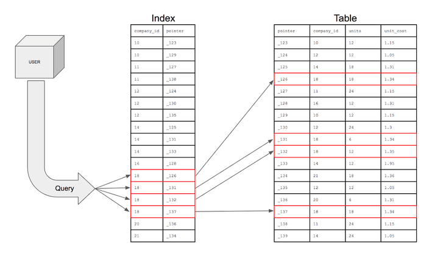

# 인덱스보고서

## 인덱스란? 
인덱스란 추가적인 쓰기 작업과 저장 공간을 활용하여 데이터베이스 테이블의 검색 속도를 향상시키기 위한 자료구조이다. 만약 우리가 책에서 원하는 내용을 찾는다고 하면, 책의 모든 페이지를 찾아 보는것은 오랜 시간이 걸린다. 그렇기 때문에 책의 저자들은 책의 맨 앞 또는 맨 뒤에 색인을 추가하는데, 데이터베이스의 index는 책의 색인과 같다.
데이터베이스에서도 테이블의 모든 데이터를 검색하면 시간이 오래 걸리기 때문에 데이터와 데이터의 위치를 포함한 자료구조를 생성하여 빠르게 조회할 수 있도록 돕고 있다.




## 인덱스를 통해 쿼리의 성능 개선
### 1. 콘서트 스케줄 조회 쿼리
- 설명: 사용자가 콘서트 예약하기 위해 콘서트 날짜 조회하기 위해 사용됩니다.
- 호출 빈도: 높음
- 쿼리 복잡도: 낮음
  - 하나의 테이블의 모든 컬럼을 조회합니다.
- 해당 테이블의 기존 인덱스
```sql
# 해당 테이블의 기존 인덱스
| Table             | Non_unique | Key_name | Seq_in_index | Column_name  | Collation | Cardinality | Sub_part | Packed | Null | Index_type | Comment | Index_comment | Ignored |
|-------------------|------------|----------|--------------|--------------|-----------|-------------|----------|--------|------|------------|---------|---------------|---------|
| concert_schedules | 0          | PRIMARY  | 1            | schedules_id | A         | 16,394,367  |          |        |      | BTREE      |         |               | NO      |
```

- 쿼리
```sql
SELECT schedules_id, concert_id, schedules_date, concert_price
from concert_schedules cs 
where cs.concert_id = 3
and cs.schedules_date > now() 
```

## 테스트 환경 세팅 및 실행 계획
### 데이터 세팅
1. 테스트 테이블: concert_schedules
2. 데이터 수: 1000만 건 이상
3. 복합 인덱스 구성: (concert_id, schedules_date)

### 기존 성능


- 적용 전 mysqlslap 성능
.png)


- 적용 전 explain 성능
.png)


### 복합 인덱스 
```sql
CREATE INDEX idx_concert_schedules 
ON concert_schedules (concert_id, schedules_date);
```
1. WHERE 절 조건 순서 최적화
2. B-tree 구조로 정렬되어 저장(범위 검색 최적화)


### 복합 인덱스 적용 후 성능


- 적용 후 mysqlslap 성능
.png)


- 적용 전 explain 성능
.png)


| 측정 항목      | 적용 전   | 적용 후  | 개선율  |
|---------------|---------:|---------:|--------:|
| 평균 실행 시간 | 10.137초 | 0.060초  | 99.4%   |
| 최소 실행 시간 |  7.875초 | 0.047초  | 99.4%   |
| 최대 실행 시간 | 11.843초 | 0.063초  | 99.5%   |

